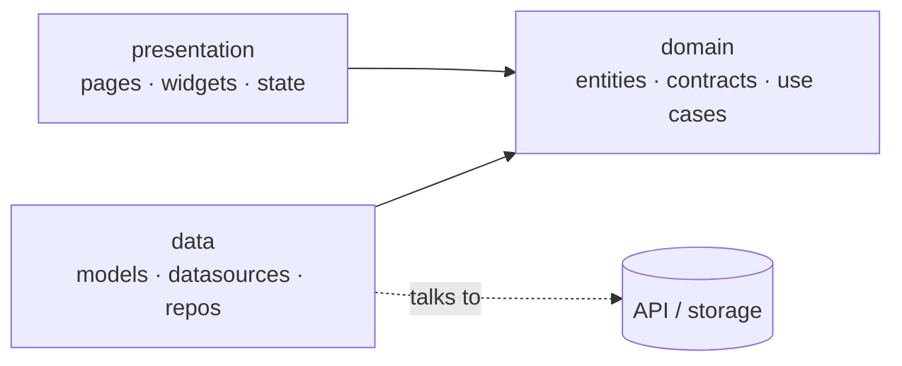

# Flutter Clean Architecture

A skill that helps you build Flutter apps the right way — every feature comes out
**layered, type-safe, lint-clean, and tested** instead of ad-hoc. It follows
**feature-first Clean Architecture** and keeps your code organized as the app grows.

---

## Installation

The fastest way — works across agents (Claude Code, Cursor, Windsurf, …):

```bash
npx skills@latest add Mkhira/flutter-clean-architecture
```

Pick the skill and your agent when prompted; it installs into the right place
automatically.

**As a Claude Code plugin** — this repo ships a plugin marketplace, so you can
install it natively:

```
/plugin marketplace add Mkhira/flutter-clean-architecture
/plugin install flutter-clean-architecture@flutter-clean-architecture
```

The skill then activates automatically on any Flutter/Dart task.

**Manual install** — clone the repo and copy the skill folder into your agent's
skills directory (for Claude Code that's `~/.claude/skills/`):

```bash
git clone https://github.com/Mkhira/flutter-clean-architecture.git
cp -R flutter-clean-architecture/skills/flutter-clean-architecture ~/.claude/skills/
```

### Requirements

- **Flutter** installed and on your `PATH`.
- **Dart 3.0+** — generated code uses Dart 3 features (sealed classes, pattern
  matching). The skill detects your SDK and warns if it's below this floor.
- Validated on **Flutter 3.41–3.44 / Dart 3.11–3.12** (see `CHANGELOG.md`).

---

## Project structure

The project is **feature-first**: shared foundations live in `core/`, the app
boots from `app/`, and each feature is a self-contained folder split into three
layers.

```
lib/
├── core/        shared foundations used across the whole app
│   ├── di/             dependency injection setup
│   ├── theme/          colors, text styles, design tokens (light/dark)
│   ├── localization/   languages & translations
│   ├── router/         app routes and navigation
│   ├── network/        Dio client + interceptors
│   ├── error/          failures and error mapping
│   └── env/            environment config (dev / staging / prod)
│
├── app/         the root App widget and startup
│
└── features/<feature>/
    ├── domain/        entities · repository contracts · use cases   (pure Dart)
    ├── data/          models · datasources · repository implementations
    └── presentation/  state management · pages · widgets
```

### The three layers of a feature

- **domain** — the heart of the feature. Holds the business **entities**,
  abstract **repository contracts**, and **use cases** (one action each). It's
  **pure Dart** — no Flutter, no Dio, no packages — so it never breaks when the
  outside world changes.
- **data** — talks to the outside world. **Models** parse JSON, **datasources**
  call the API (or local storage), and **repository implementations** fulfill the
  contracts the domain defines, mapping raw errors into clean domain failures.
- **presentation** — what the user sees. **State management** (Bloc, Riverpod,
  etc.) coordinates, **pages** lay out screens, and **widgets** render.

### How the layers depend on each other



Both `presentation` and `data` depend on `domain` — never the reverse, and
`presentation` never reaches into `data` directly. The result: **UI renders,
state coordinates, domain holds the logic, and data talks to the outside world.**
Network and infrastructure errors never leak into your widgets, and `domain/`
stays pure Dart.

---

## What it supports

- **Five state-management stacks** — Bloc/Cubit (default), Riverpod, Provider,
  GetX, MobX. Only the presentation layer changes between them; domain and data
  stay the same.
- **API features from a contract** — give it a Swagger/OpenAPI spec or a sample
  JSON and it generates the entities, models, and networking for you. It never
  invents API models.
- **Networking** — Dio + Retrofit with proper error mapping.
- **Theming** — centralized light/dark theme and design tokens.
- **Localization** — multi-language support (e.g. Arabic + a language switcher).
- **Routing** — go_router with auth-gated routes.
- **Auth** — token auth with secure storage.
- **Flavors & environments** — dev / staging / prod.
- **Tests** — unit, bloc, and golden tests.

---

## Built on SOLID & Clean Architecture

The skill doesn't just put files in folders — it applies **Clean Architecture**
and **SOLID** principles to every feature it touches:

- **Single Responsibility** — each use case does one thing, each datasource has
  one job, widgets only render. Logic lives in the domain, not in the UI.
- **Open/Closed & Dependency Inversion** — the domain depends on **abstract
  repository contracts**, and the data layer implements them. You can swap a
  data source (real API, fake, cache) without touching the domain or UI.
- **Interface Segregation** — small, focused contracts instead of one giant
  service class.
- **Clean boundaries** — the dependency rule is enforced: `domain` stays pure
  Dart, `presentation` never reaches into `data`, and outside errors are mapped
  into clean domain failures before they ever reach a widget.

The payoff: code that is **testable, easy to change, and consistent** — every
feature has the same predictable shape.

---

## Works with your SDK and packages

The skill adapts to **your installed environment** instead of forcing fixed
versions:

- **Detects your SDK** — it reads your installed Flutter/Dart version and the
  SDK constraint declared in your project, then generates code that fits. Modern
  Dart 3 features (sealed classes, pattern matching) are used when your SDK
  supports them, and it **warns you** if your SDK is too old instead of silently
  shipping code that won't compile.
- **Resolves the latest compatible packages** — rather than hand-pinning version
  numbers, it lets Pub pick the newest versions that work together for your SDK.
  That keeps your dependencies current and avoids version conflicts.
- **Adapts to package APIs** — if a package's API differs across versions, it
  matches the version actually installed in your project.

---

## Create a new project

Just describe what you want:

```
/flutter-clean-architecture create flutter project shop_app
```

Steps it walks you through:

1. **Name & location** — it asks for the project name, directory, and org.
2. **Scope** — choose **Full** (demo feature + flavors + everything wired) or
   **Lean** (minimal foundation).
3. **State management** — pick your stack (Bloc, Riverpod, Provider, GetX, MobX).
4. **Scaffold** — it builds the foundation, wires everything, and validates it.

Minimal example:

```
/flutter-clean-architecture create a lean flutter project shop_app, no flavors, riverpod
```

---

## Use it in an existing project

Open your Flutter project and just ask — the skill activates automatically on any
Flutter/Dart task. It **inspects your conventions and detects your stack**, so it
follows your setup instead of imposing its own.

When working in an existing project it:

- **Detects your state-management stack** (Bloc, Riverpod, Provider, GetX, MobX)
  and matches it — it never switches you to a different one.
- **Follows your existing folder and naming conventions** instead of imposing
  its own.
- **Adds new features in clean, layered, SOLID shape** — domain / data /
  presentation — so the codebase stays consistent as it grows.
- **Works against your installed SDK and packages**, resolving compatible
  versions for what you already have.
- Can **review existing code** against Clean Architecture and SOLID and point out
  where boundaries are crossed.

Common requests:

```
add an elixirs feature from this swagger: <spec> path /Elixirs
add a products feature from this sample JSON
add dark mode and centralize the theme
add Arabic localization + a language switcher
add token auth with secure storage and gate the routes
review this against clean architecture / SOLID
add golden tests for the cards
```

---

## What it's useful for

- Starting a new Flutter app with a clean, scalable foundation from day one.
- Adding new features fast without breaking the architecture.
- Turning an API contract straight into working, type-safe Dart code.
- Keeping a growing codebase consistent — same shape for every feature.
- Bringing structure and best practices to an existing project.

---

## Limitations

A few things the skill intentionally **won't** do — so you know what to expect:

- **Won't invent API models.** It needs a real OpenAPI/Swagger spec or a sample
  JSON response; it won't guess fields, types, or endpoints.
- **Won't switch your state-management stack.** In an existing project it detects
  and follows your stack — it never migrates you from one to another.
- **Won't edit generated files.** Files produced by `build_runner` (`*.g.dart`,
  `*.freezed.dart`, etc.) are regenerated, not hand-edited.
- **Codegen automation is best on Claude Code.** The architecture guidance works
  on any agent, but the bundled generator scripts are designed to run in Claude
  Code; other agents still get the layered patterns, just without that
  automation.
- **Requires Dart 3.0+.** Generated code uses Dart 3 features — on an older SDK
  the skill warns instead of shipping code that won't compile.
- **Not a backend or design tool.** It builds the Flutter client; it doesn't
  create APIs, databases, or UI designs for you.

---

## Built with this skill

Real features it has generated, each in the same clean, layered shape:

| Feature | Source | Highlights |
|---|---|---|
| **products** | fake datasource | paginated list, infinite scroll + pull-to-refresh |
| **elixirs** | Wizard World API | nested ingredients/inventors, difficulty filter |
| **houses** | Wizard World API | nested heads/traits, themed Hero avatars |
| **auth** | fake | secure-storage tokens, auth-gated routing |

Every one follows the same path: describe it → fill the remaining logic → wire DI,
route, and localization → validate.

---

## Contributing

Issues and pull requests are welcome — see [`CONTRIBUTING.md`](CONTRIBUTING.md).

## License

[MIT](LICENSE) © Mkhira
